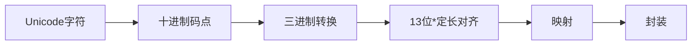

# Lingicrypt - 灵感菇编码

在现有计算机进制的体系下基于某种进制去映射对应字符，再将结果加上特定格式的字符串进行封装，最后输出得到类似于`"灵感菇🍄哩菇哩菇哩哇擦灵感菇灵感菇🍄"`的语句。

> 说白了，进制是可选的，映射是可选的，怎么封装是看出题人🧠的，所以misc题是粗制滥造的 —— 不建议出此类题目用于misc，出点古典密码让人知道代换和置换的理念就差不多得了。

编码过程图示如下：




*为了能覆盖全Unicode，进行了13位补齐【log3(0x10FFFF) ≈ log(1114111)/log(3) ≈ 12.3】

解码过程：


### Usage

```cmd
python main.py [-h] (-e | -d) [-f FILE] [-o OUTPUT] [text]
```


### 尾

其实该项目就是一个AI速成品，用来批判目前Misc题目粗制滥造，为了出题而出题，各种抽象炫技，大量给选手喂*的情况（

misc - 安全杂项，作为CTF里面涉及很广的一个分区，如何让他发挥作用去普及网络安全和CTF竞赛？

笔者认为，网络安全或者说相关比赛的传播范围和普及范围要远远超过所谓的“技术”
